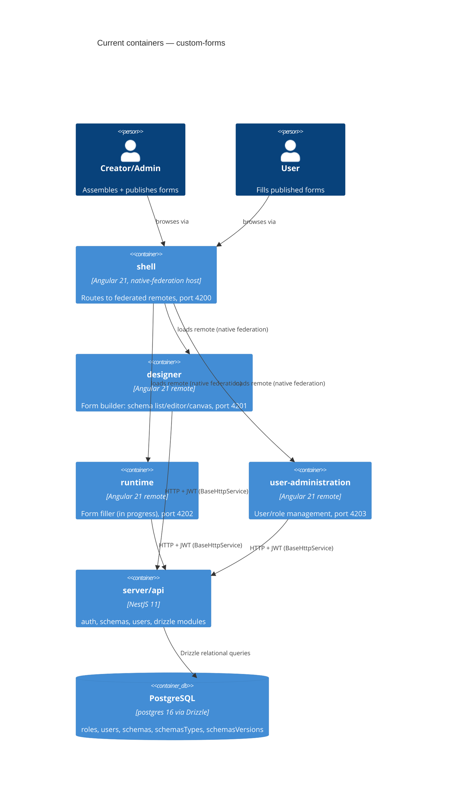

# Architecture map — custom-forms

> The **current** architecture (what exists today), produced by `map-architecture` and read by
> write-prd / architecture-design / generate-data-model / implement-tasks. Refresh with
> `/sdlc-map-architecture` when the repo drifts past `reflects_commit`. This is generated; a
> hand-maintained `docs/architecture.md`, if present, is authoritative and reconciled below — not
> replaced. (No such doc exists in this repo; each feature's `docs/features/<feature>/sad.md` is the
> closest authored architecture doc, and each is a target/intent document — see Reconciliation below.)

## Stack

- Language / runtime: TypeScript 5.7.0 (`package.json:85`), Node.js 20.19.9 (`package.json:61`)
- Frontend: Angular 21.2.5 (`package.json:101`), zoneless + Signals (`client/apps/designer/src/app/app.config.ts:11`), NX 22.6.1 (`nx.json:78`), `@angular-architects/native-federation` 21.2.2 (esbuild-based Module Federation, `package.json:31`)
- Backend: NestJS 11.1.17 (`package.json:106-107`), Express platform
- Persistence: Drizzle ORM 0.40.0 (`package.json:117`) + `postgres` driver 3.4.0 (`package.json:121`) over PostgreSQL 16
- Build / test / lint:
  - Backend: Jest 30.3.0 (`server/api/jest.config.js`), `nx serve/build/test api`
  - Frontend: Vitest 4.0.8 via `@analogjs/vitest-angular` (`nx.json:100`), Storybook 10.3.1 (`nx run ui:storybook`)
  - E2E: Playwright 1.36.0 (`client/apps/designer-e2e/playwright.config.ts`)
  - DB: `drizzle-kit generate/migrate/push/studio` (`package.json` scripts, `drizzle.config.ts`)

## C4 — system as it is

## Module inventory

| Module               | Path                              | Layers                                                                                                            | Wired at                                                                         | Responsibility                                                          |
| -------------------- | --------------------------------- | ----------------------------------------------------------------------------------------------------------------- | -------------------------------------------------------------------------------- | ----------------------------------------------------------------------- |
| shell                | `client/apps/shell`               | host app                                                                                                          | `client/apps/shell/federation.config.js`                                         | Federation host, routing to remotes, role-based guard                   |
| designer             | `client/apps/designer`            | remote app: `form-list/`, `form-editor/` (`canvas/`, `component-palette/`, `properties-panel/`), `schema-viewer/` | `client/apps/designer/federation.config.js:6-8` (exposes `./Routes`)             | Creator-facing form builder                                             |
| runtime              | `client/apps/runtime`             | remote app (currently minimal)                                                                                    | `client/apps/shell/federation.config.js:8`                                       | User-facing form filler (in progress)                                   |
| user-administration  | `client/apps/user-administration` | remote app                                                                                                        | `client/apps/shell/federation.config.js:9`                                       | User/role management                                                    |
| api-client (lib)     | `client/libs/api-client`          | generated DTOs                                                                                                    | `client/libs/api-client/src/lib/api.ts:6-10`                                     | Swagger-generated typed HTTP DTOs                                       |
| http (lib)           | `client/libs/http`                | infra                                                                                                             | `client/libs/http/src/lib/base-http.service.ts:1-26`                             | `BaseHttpService` wrapping `HttpClient`, `API_BASE_URL` token           |
| auth (lib)           | `client/libs/auth`                | infra                                                                                                             | `client/libs/auth/src/lib/auth.interceptor.ts:1-9`, `auth-state.service.ts:1-28` | JWT storage (localStorage), signal-based auth state, HTTP interceptor   |
| ui (lib)             | `client/libs/ui`                  | shared design system                                                                                              | `client/libs/ui/src/lib/{button,input,select}`                                   | Shared standalone components + Storybook                                |
| drizzle              | `server/api/src/app/drizzle`      | infra                                                                                                             | `server/api/src/app/drizzle/drizzle.module.ts:1-23`                              | DB connection, exports `DRIZZLE_DB` token                               |
| auth                 | `server/api/src/app/auth`         | domain module (controller/service/dto)                                                                            | `server/api/src/app/auth/auth.module.ts:1-21`                                    | Register/login, JWT issuing (`bcryptjs`, `@nestjs/jwt`, `passport-jwt`) |
| schemas              | `server/api/src/app/schemas`      | domain module (controller/service/dto)                                                                            | `server/api/src/app/schemas/schemas.module.ts`                                   | Form schema CRUD + publish (versioning)                                 |
| users                | `server/api/src/app/users`        | domain module                                                                                                     | (per SAD §2; roles guard)                                                        | User CRUD + role assignment                                             |
| db schema/migrations | `server/api/src/db`               | data                                                                                                              | `server/api/src/db/schema.ts:1-94`, `server/api/src/db/migrations/`              | Drizzle table defs + generated SQL migrations                           |

**Planned, not yet present in code** (per `docs/adr/0001-*.md`): `forms-data` and `templates` NestJS modules + tables.

## Conventions (cited)

- **Module wiring / registration:** one NestJS module per domain, `<domain>.module.ts` declares `controllers`/`providers` — `server/api/src/app/auth/auth.module.ts:1-21`
- **Error handling:** NestJS built-in HTTP exceptions (`NotFoundException`, `ForbiddenException`, `ConflictException`, `UnauthorizedException`), default `{statusCode, message, error}` shape, no custom global filter — `server/api/src/app/schemas/schemas.service.ts:2-6`
- **IDs:** UUID v4, `uuid('id').primaryKey().defaultRandom()` — `server/api/src/db/schema.ts:15`
- **Persistence / DB access:** services inject `DRIZZLE_DB` via `@Inject`, use Drizzle relational queries (`findFirst`/`findMany` with `with:`, `insert().returning()`) — `server/api/src/app/schemas/schemas.service.ts:15,18-52`
- **Migrations:** drizzle-kit generated, `NNNN_<generated-name>.sql` zero-padded counter, out dir set in `drizzle.config.ts` — `server/api/src/db/migrations/0000_unknown_night_nurse.sql`
- **Tests:** backend Jest with `Test.createTestingModule()` + mocked `DRIZZLE_DB` (`server/api/src/app/auth/auth.service.spec.ts:17-86`); frontend Vitest with `TestBed` + `HttpTestingController` (`client/apps/designer/src/app/form-list/form-list.spec.ts:25-123`); e2e Playwright via `nxE2EPreset` (`client/apps/designer-e2e/playwright.config.ts`)
- **Inter-module communication:** frontend calls backend over HTTP via `BaseHttpService` + `authInterceptor` attaching `Authorization: Bearer <token>` — `client/libs/http/src/lib/base-http.service.ts:11-25`, `client/libs/auth/src/lib/auth.interceptor.ts:3-9`
- **UI / styling:** standalone Angular components (`input()`/`output()`, `ChangeDetectionStrategy.OnPush`), per-component SCSS, shared primitives in `client/libs/ui`, Storybook per component — `client/libs/ui/src/lib/button/button.ts:1-21`

## Datastores

| Store      | Engine        | Accessed via                                                  | Notes                                                                                                                                                                                                                                      |
| ---------- | ------------- | ------------------------------------------------------------- | ------------------------------------------------------------------------------------------------------------------------------------------------------------------------------------------------------------------------------------------ |
| Primary DB | PostgreSQL 16 | Drizzle ORM (`postgres` driver), `DRIZZLE_DB` injection token | Connection via `DATABASE_URL` env — `server/api/src/app/drizzle/drizzle.module.ts:16`; schema at `server/api/src/db/schema.ts`; tables: `roles`, `users`, `schemas`, `schemasTypes`, `schemasVersions` (JSONB for schema/version payloads) |

## Frontend / UI foundation

- **Component library / design system:** in-repo `client/libs/ui/src/lib/` — `button`, `input`, `select`, each standalone with Storybook stories
- **Design tokens:** none centralized yet — styling is per-component SCSS with local constants (e.g. `ROW_HEIGHT_PX`, `COLS` in `client/apps/designer/src/app/form-editor/canvas/canvas.ts:14-15`); no global token/theme file found
- **Styling approach:** plain SCSS per component (BEM-like class names), no CSS framework; ag-grid CSS imported globally where used (`client/apps/designer/project.json:71-73`)
- **Shared primitives:** `client/libs/ui/src/lib/{button,input,select}` — standalone components with `input()`/`output()`, `OnPush`, `.stories.ts`, `.spec.ts`
- **State / data-fetching:** Angular Signals for local/component state (e.g. `form-list.ts` `rowData`, `isLoading`); `AuthStateService` for auth state (`client/libs/auth/src/lib/auth-state.service.ts:3-14`); no shared server-cache/store lib beyond `BaseHttpService`
- **Closest UI precedent:** a new Designer screen composing draggable/editable panels looks like `client/apps/designer/src/app/form-editor/canvas/canvas.ts:1-154` (drag/resize/grid-snap) + `component-palette/` + `properties-panel/`

## Where things live / closest precedents

- A new backend domain feature → `server/api/src/app/<domain>/` with `<domain>.{module,controller,service}.ts` + `dto/`, modelled on `schemas` (`server/api/src/app/schemas/schemas.service.ts:1-113`)
- A new Designer screen/component → `client/apps/designer/src/app/<feature>/`, composed from `client/libs/ui` primitives, modelled on `form-list` (`client/apps/designer/src/app/form-list/form-list.ts:1-138`) for list/CRUD screens or `form-editor/canvas` for drag/drop editing surfaces
- A new federated remote app → follow `client/apps/designer/federation.config.js` pattern, registered in `client/apps/shell/federation.config.js`
- A new DB table → add to `server/api/src/db/schema.ts`, generate migration via `drizzle-kit generate`

## Constraints & known tech-debt

- `client/libs/api-client` is auto-generated from Swagger and regenerated manually — a backend DTO change requires re-running `nx run api-client:generate`, or the frontend types silently drift
- `forms-data` and `templates` modules/tables are architecturally decided (ADR-0001) but not yet implemented — any feature depending on per-User form submissions or reusable templates needs these built first
- No global design-token/theme file — new UI work should introduce one deliberately rather than continuing ad hoc per-component constants
- No custom global NestJS exception filter — error responses are NestJS's default shape; a feature needing a different error contract must add this explicitly
- Single-VM Docker Compose deployment target (per SAD §7) — no auto-failover, relevant to any HA-sensitive feature
- No observability stack (metrics/alerts/tracing) yet — flagged as a gap in `sad.md` §11

## Reconciliation with the authored architecture doc

Each `docs/features/<feature>/sad.md` (e.g. `docs/features/runtime/sad.md`, `docs/features/designer/template-actions/sad.md`) is a per-feature Arc42 SAD (status: Draft), not a repo-wide architecture doc — together they describe the **intended** architecture for the custom-forms project, including two modules (`forms-data`, `templates`) not yet present in code. This map reflects the **verified current state**; where a feature's `sad.md` and the code disagree (planned-but-unbuilt modules), this map defers to the code and notes the gap above.
