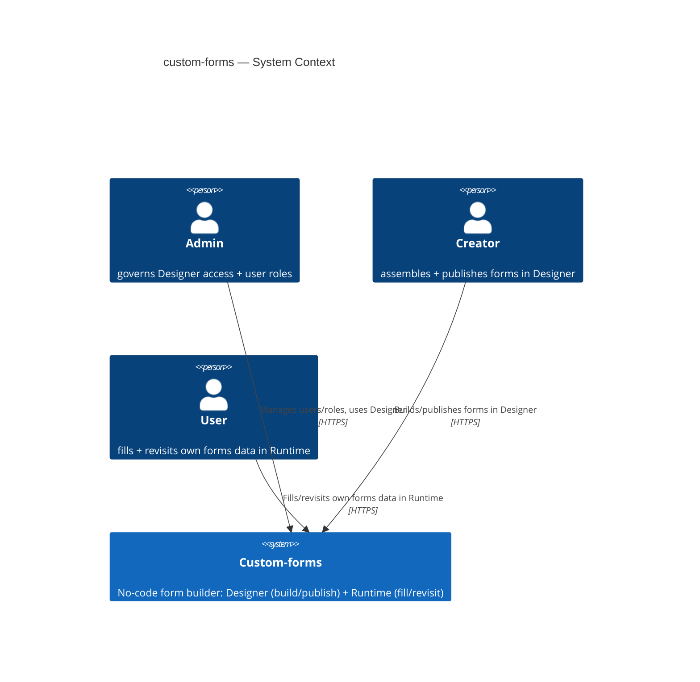
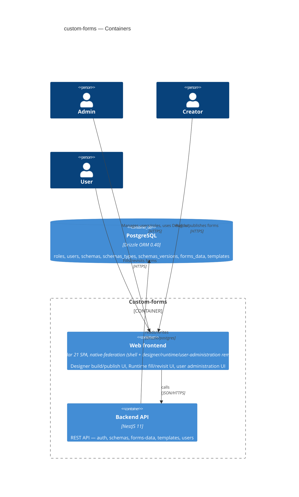
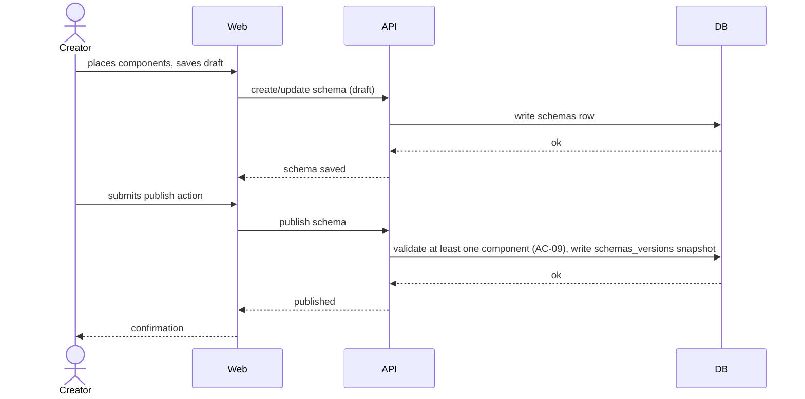
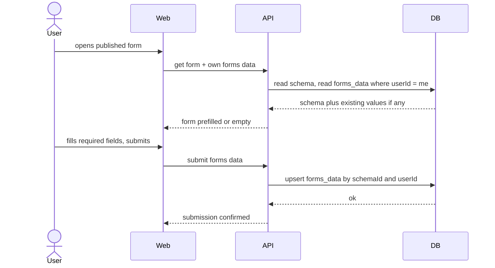
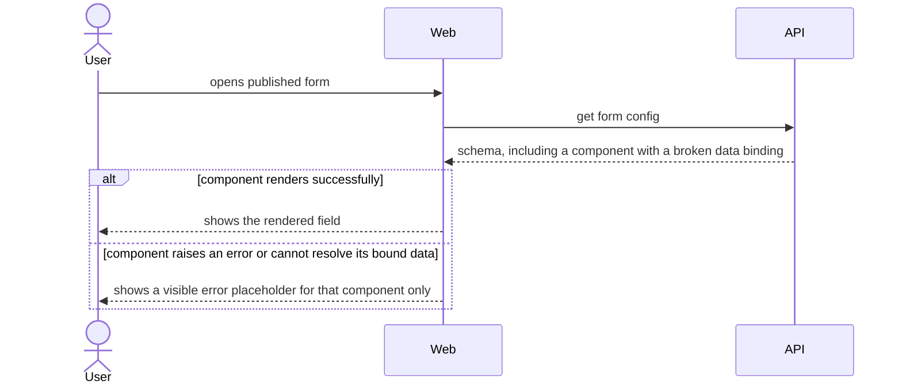

# Software Architecture Document — custom-forms

<!-- Stages 04-05 → see sdlc/plugin/skills/architecture-design/SKILL.md -->
<!-- 12 Arc42 sections. Empty sections — <!-- N/A: <one-line reason> -->. -->
<!-- C4 Context (L1) lives inline in §3. C4 Container (L2) lives inline in §5. -->
<!-- §6 Runtime view seeds the primary flow(s) here; complete-sequence-diagrams (stage 06) then -->
<!--    fills §6 with every critical flow / §5 AC — no cap. -->
<!-- Numbers in §10 come VERBATIM from PRD §6 NFR — no inventing, no rounding. -->
<!-- Заповнений приклад: див ~/sources/beerphp/beerlms/docs/features/course-lesson-mvp/sad.md -->

## 1. Introduction and goals

**Intent.** Custom-forms is the first step toward a broader no-code application-building platform. A Creator (technical, implementation-facing consultant) assembles a working form screen from a curated component library without writing code — removing the developer-queue bottleneck on screen delivery. A User fills in a Creator-published form and sees their own previously-entered values when they return. Access is governed by three roles — Admin, Creator, User — from day one.

**Top-3 quality goals (1-liners; full scenarios in §10):**

1. Rendering correctness under component-library evolution — Runtime never renders a published form blank or silently broken, even after the curated component library changes.
2. Authorization & data-isolation integrity — the three-role access boundary and per-User forms-data isolation hold under every access path.
3. Responsiveness — Designer save and Runtime render stay within their p95 latency targets.

**Stakeholders.**

| Role | Interest | Sign-off owner? |
|---|---|---|
| Admin | Governs Designer access + user roles | No |
| Creator | Assembles/publishes forms, manages schemas/templates | No |
| User | Fills published forms, owns their own submitted data | No |
| Tech Lead | SAD approval | Yes |
| Security Lead | Reviews the new authz boundary + data-isolation guarantee | Yes |

<!-- Decision overrides (¶4) — populated by the Step-7 critic resolution loop, empty otherwise.       -->
<!-- Each: «Decision override: <headline> — rationale: <reason>» so downstream skills see the choice.  -->

## 2. Constraints

**Technical.**
- Angular 21 (zoneless, Signals) + NX 22.6.1 monorepo
- `@angular-architects/native-federation` (esbuild-based Module Federation, NOT Webpack) — shell host (port 4200) + federated remotes: designer (4201), runtime (4202), user-administration (4203)
- NestJS 11 backend (`server/api`), Express platform
- Drizzle ORM 0.40 + PostgreSQL (`postgres` driver), JSONB columns for schema storage
- Auth: `@nestjs/jwt` + `passport-jwt`; `bcryptjs` (12 rounds) for password hashing
- `@nestjs/swagger` — OpenAPI docs at `/api/docs`

**Organisational.**
- Feature size **L** (`.size`) — full 12-section SAD, 10-15 ADRs expected
- Hard build-sequence constraint (PRD §1): US-01/02/03 (auth + role administration) ship before US-04+ (Designer/Runtime capabilities)
- No deadline / effort budget stated in PRD → `<TBD by PM>` (see §11 Risks)

**Conventions.**
- No repo-level `CLAUDE.md` — conventions below are inferred from the existing (brownfield) code at commit `0a09af4`, not an authored standard
- Backend: one NestJS module per domain (`app/{auth,schemas,users,drizzle}`), each with `.controller.ts` / `.service.ts` / `.module.ts` / `dto/`; services inject `DRIZZLE_DB` and use Drizzle relational queries
- Frontend: NX apps = shell (host) + federated remotes; shared libs (`http`, `auth`, `ui`, `api-client`); standalone Angular components + signals
- ID strategy: UUID v4 (`uuid('...').primaryKey().defaultRandom()`)
- DTO naming: `{Action}{Entity}Dto`

**Regulatory / external.**
- PRD §6.1: Security review **Required** — new authz boundary (3 roles), new forms-data isolation guarantee, unresolved personal-data-field question
- Data classification: internal
- Named abuse cases to defend: config injection (XSS), draft leak, cross-User forms-data leak, component-library tampering, spam screen creation (rate-limit 30 saves/min/account)

## 3. Context and scope

Custom-forms is an internal no-code tool: a Creator (or Admin) assembles a form screen from a curated component library in Designer and publishes it; a User then fills that published form in Runtime and sees their own previously-submitted values on return. Admin additionally governs who holds which role. The system is self-contained — PRD §3 explicitly puts external-system integrations and workflow automation out of scope for this iteration, and the existing auth is homegrown (JWT/passport), not an external Identity Provider.

**External systems (in / out):**

| Actor or system | Type | Interaction |
|---|---|---|
| Admin | Person | Manages user accounts/roles, uses Designer |
| Creator | Person | Assembles/publishes forms + templates in Designer |
| User | Person | Fills/revisits own forms data in Runtime |
| *(none)* | — | No external systems this iteration — deliberate (PRD §3 non-goal: workflow automation / external integrations out of scope; auth is self-hosted JWT, not an external IdP) |

**C4 Context (L1):**



## 4. Solution strategy

**Target surface(s) (the first decision — what's being built):** `[backend-service, web-frontend]`

Both surfaces already exist in the brownfield (`server/api` NestJS backend; `client/apps/{shell,designer,runtime,user-administration}` Angular federation) and PRD US-04+ requires extending both — this is a continuation, not a fresh multi-surface pick, so it stays inline (no ADR): the "legitimate alternative" blast-radius criterion doesn't fire when the alternative is excluded by an existing, already-shipped architecture.

**UI-architecture (web-frontend):** Continue the existing SPA + `@angular-architects/native-federation` model — shell host + federated remotes, no SSR. custom-forms is an internal tool with no SEO requirement, so there's no product signal to justify introducing a second rendering paradigm. Inline, no ADR (same reasoning as the surface pick — this extends, not replaces, the established architecture).

**Top strategic choices (the seeds for ADRs):**

1. **Dedicated `forms_data` + `templates` tables** (→ ADR-0001) — forms data (AC-17: one row per User per form, upsert not history) and templates (AC-24: independent copy, no ongoing link to source) are new entities absent from the brownfield's `schemas` / `schemas_versions` tables. Two new tables keep each entity's invariants as native constraints instead of overloading tables whose existing semantics mean something else.
2. **Per-endpoint `@Roles()` + the existing `RolesGuard`** (→ ADR-0002) — the brownfield already implements `RolesGuard`/`@Roles()` under `server/api/src/app/users/` but never applies it to `/schemas`; PRD's new authz requirements (AC-05, AC-06) need it applied across `schemas`/`forms-data`/`templates`/`users` controllers. Runtime endpoints stay guard-open to all three roles and rely on `userId`-scoping instead (AC-20 is identity-scoping, not role-gating).
3. **UI-architecture: SPA consuming the backend API, unchanged from the brownfield** — see above; inline, no ADR.

Each tactical decision in later sections should be traceable to one of these strategic seeds. Tactical decisions that *contradict* a strategic choice are red flags — surface them in §11 Risks.

## 5. Building block view

Backend stays a layered NestJS module-per-domain style (already the brownfield convention — no divergence proposed). Two new modules land alongside the existing three, per ADR-0001's table split: `forms-data` and `templates`. The `schemas` module gains one new cross-module read (into `forms-data`) to enforce AC-10b's field-removal guard — before allowing a field removal, `schemas.service` asks `forms-data.service` whether any submitted row has a value under that field's key.

**Internal decomposition (backend, `server/api/src/app/`):**
```
app/
├── auth/          <existing — login/register, JWT strategy>
├── users/         <existing — user CRUD + role assignment, RolesGuard>
├── schemas/       <existing, extended — + field-removal guard (AC-10b) reads forms-data>
├── forms-data/    <NEW (ADR-0001) — per-User submitted values, upsert-on-resubmit (AC-17)>
├── templates/     <NEW (ADR-0001) — named independent schema copies (AC-21/AC-24)>
└── drizzle/       <existing — DB module>
```

**Internal decomposition (frontend, `client/apps/`):**
```
designer/src/app/
├── form-list/            <existing, extended — also lists templates (AC-11)>
├── form-editor/          <existing — canvas/palette/properties-panel>
├── schema-viewer/        <existing>
└── template-actions/     <NEW — save-as-template, create-from-template>

runtime/src/app/          <currently empty routes — filled this iteration>
├── form-list/            <NEW — AC-30 temporary discovery list of published forms>
└── form-viewer/          <NEW — render, fill, prefill own data, delete own data>
```

**C4 Container (L2):**



The 4 federated frontend apps (shell/designer/runtime/user-administration) are shown as one `web` container since they're one declared `web-frontend` surface at this zoom level — the federation split is pre-existing deployment infrastructure, not new architecture this feature introduces.

## 6. Runtime view

architecture-design seeds the primary flows below; `complete-sequence-diagrams` (stage 06) then covers every remaining critical flow / §5 AC.

**Critical flow 1: Creator assembles and publishes a form**



**Critical flow 2: User fills, submits, and later returns to a published form**



**Critical flow 3: Runtime shows a visible error placeholder for a broken component (AC-16)**



## 7. Deployment view

Production runs as **Docker Compose on a single VM** (ADR-0003) — extending the existing `docker-compose.dev.yml` pattern (currently dev-only, Postgres alone) into a prod compose file: one Postgres 16 container, one NestJS API container, one Nginx container serving the 4 Angular apps' production builds and reverse-proxying `/api` to the NestJS container. No replicas, no orchestration platform — proportionate to a 99.0% monthly SLO and ≥5 req/s throughput target for an internal MVP tool.

**Monitoring:**
- No observability stack (metrics/alerts/tracing) exists in the brownfield — this is a gap, not a claim; tracked in §11 Risks rather than fabricated here.

**Scaling thresholds (from PRD §6 NFR, verbatim):**
- Throughput ≥5 req/s per instance — smoke test in CI; comfortably met by a single instance.
- Designer schemas/templates list: renders up to 500 combined schemas+templates without a UI freeze >1s — comfortable in a single Postgres table each, no partitioning needed at this scale.
- Availability 99.0% monthly SLO (internal MVP tool, business hours) — single VM has no automatic failover; acceptable at this SLO, revisit if the target rises.

## 8. Crosscutting concepts

| Concept | Convention | Where defined |
|---|---|---|
| Logging | NestJS built-in `Logger` (no structured/JSON logging framework found in brownfield) — continue as-is | server/api default |
| Authentication | JWT via `@nestjs/jwt` + `passport-jwt`, `bcryptjs` hashing — existing, unchanged | `server/api/src/app/auth/` |
| Authorization | Per-endpoint `@Roles()` + `RolesGuard` (ADR-0002) | §4 |
| Error handling | NestJS default `HttpException` JSON shape (`{statusCode, message, error}`) — no custom global filter found in brownfield, none introduced | server/api default |
| ID strategy | UUID v4, `uuid('...').primaryKey().defaultRandom()` — existing convention, applied to `forms_data` + `templates` too | Drizzle schema |
| Internationalisation | N/A — English only, no PRD signal for i18n | — |
| Observability | Gap — no metrics/alerts/tracing in the brownfield (tracked in §7 + §11, not fabricated here) | — |
| Rate limiting *(new)* | 30 screen-save actions/min/account via `@nestjs/throttler` — PRD §6.1 abuse case (spam screen creation); no throttling exists in the brownfield yet | new, this feature |
| Config sanitization *(new)* | Text/link component values rendered via Angular's default template binding (`{{ value }}`), never `[innerHTML]`/`bypassSecurityTrust*` — always escaped, never executed as markup (AC-15, XSS abuse case) | new, this feature |

## 9. Architecture decisions

| # | Title | Status | Section |
|---|---|---|---|
| 0001 | Store forms data and templates as two dedicated tables | Accepted | §4 |
| 0002 | Enforce the three-role model with a per-endpoint @Roles() + RolesGuard | Accepted | §4 |
| 0003 | Deploy production as Docker Compose on a single VM | Accepted | §7 |
| 0004 | Run custom-forms as a single shared instance with per-User data isolation, no organizational multi-tenancy | Accepted | §4 |

ADR files live under `docs/features/custom-forms/adr/NNNN-<title>.md`.

## 10. Quality requirements

Each top-3 goal from §1 expanded into a full scenario:

**QG-1. Rendering correctness under component-library evolution**
- **When:** a published form's configuration includes a component that fails to render (an uncaught error, or the component cannot resolve its bound data — AC-16's definition).
- **Then:** the system shows a visible error placeholder for that component instead of a blank screen or uncaught error. NFR target (PRD §6, verbatim): "0 published forms render blank or break silently in Runtime after a curated-library change." KPI target (PRD §7, verbatim): "≥95% of published forms render without a rendering error... tracked over the first 30 days post-release."
- **How verify:** PRD §6 measurement (verbatim): "manual regression check across all published forms whenever a component in the library changes"; plus an automated test asserting Flow 3's (§6) fallback renders for a mocked broken binding.

**QG-2. Authorization & data-isolation integrity**
- **When:** a User attempts to open Designer, a Creator/User attempts a role-restricted action, or two accounts (any roles, including Admin/Creator) have each submitted forms data for the same published form.
- **Then:** the User is denied Designer access with an explanation (AC-06); the role-restricted action is denied with an explanation (AC-05); each account sees only its own forms data, never another's, even across roles (AC-20).
- **How verify:** integration tests hitting every `@Roles()`-guarded endpoint (ADR-0002) with every unauthorized role; a cross-account forms-data isolation test asserting account B's read never returns account A's submitted values.

**QG-3. Responsiveness**
- **When:** a Designer save action is invoked, or a Runtime screen renders.
- **Then:** Designer save p95 ≤ 500 ms (PRD §6, verbatim); Runtime screen render p95 ≤ 300 ms (PRD §6, verbatim); throughput ≥ 5 req/s per instance (PRD §6, verbatim).
- **How verify:** PRD §6 measurement (verbatim): "API response telemetry" for the Designer save p95; "client-side render timing telemetry" for the Runtime p95; "smoke test in CI" for throughput.

## 11. Risks and technical debt

| Risk / debt | Severity | Mitigation | Owner |
|---|---|---|---|
| No deadline/effort budget stated in PRD | Medium | PM sets an explicit target before `/sdlc-break-tasks` | PM |
| No observability stack (metrics/alerts/tracing) in the brownfield | Medium | Wire up basic HTTP metrics/logging before production rollout | Backend |
| Single-VM deployment (ADR-0003) has no automatic failover | Medium | Revisit if the availability SLO target rises beyond 99.0% | DevOps |
| `api-client` codegen lib is empty; regeneration is a manual step — risk of type drift between backend OpenAPI and frontend | Low | Run codegen as part of the build/CI pipeline | Frontend |
| Open architectural decision: final curated component list for first release | Open question | Resolve before `/sdlc-break-tasks custom-forms`; default now is the 4 named types (Text/Number/Select/Date) | Oleksandr Vorovchenko |
| Open architectural decision: per-screen access grants beyond the three fixed roles | Open question | Resolve at next iteration scoping; conflicts with current §3 non-goal (role-level only) | Oleksandr Vorovchenko |
| Open architectural decision: page routing/navigation between multiple screens | Open question | Resolve at roadmap review; AC-30's temporary discovery list retires once this ships | Oleksandr Vorovchenko |
| Open architectural decision: real behavior for `page`/`dashboard` schema types | Open question | Resolve at roadmap review | Oleksandr Vorovchenko |

**Accepted debt (acceptable in v1, plan to fix later):**
- Component-library-change safety relies solely on AC-16's error-placeholder fallback + a manual regression check — no automated version-pinning or backward-compatibility layer for components this iteration (resolved during the §9 walk, inline, no ADR).
- Every new backend endpoint must remember to add `@Roles()` manually — no structural/lint guarantee against forgetting it (ADR-0002 negative consequence).
- All `forms_data` values are classified uniformly as "internal" — no per-field PII tagging or special retention handling this iteration; revisit if a Creator-built form is later confirmed to capture regulated personal data (resolved during the §11 walk, inline, no ADR).

## 12. Glossary

<!-- 🎯 Навіщо: ⭐ СЛОВНИК ДОМЕНУ, який припиняє суперечки через рік («checkpoint —      -->
<!--           weekly чи biweekly? Quarter — календарний чи фіскальний?»).                -->
<!-- 📋 Що писати: таблиця термін / значення. Бізнес-терміни + технічні вперемішку.       -->
<!--           Один термін може мати дві мови у заголовку: «Goal (Обʼєктив)».              -->
<!-- 📌 Приклад: «Lesson | урок усередині курсу, що складається з блоків (text, video)». -->

| Term | Meaning |
|---|---|
| <e.g. Goal> | <quarterly intent in statement form> |
| <e.g. KR> | <Key Result — measurable target linked to a Goal> |
| <e.g. Checkpoint> | <bi-weekly progress update on a KR> |
