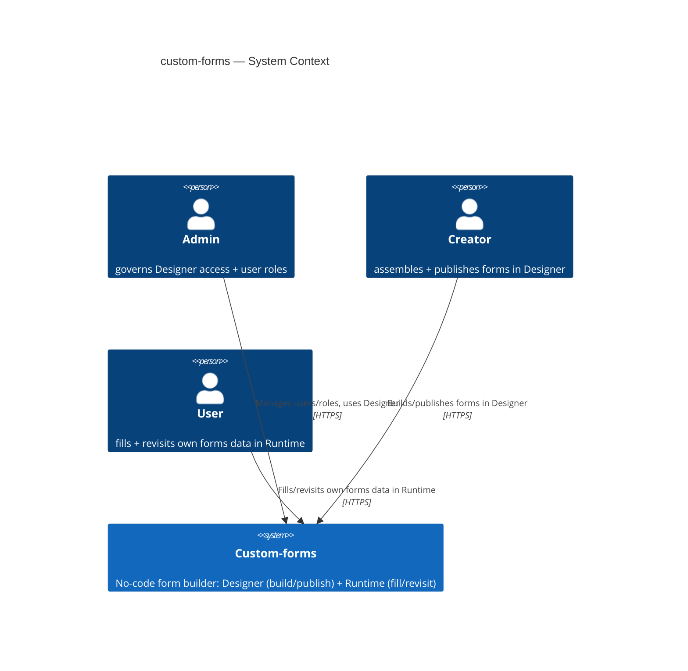
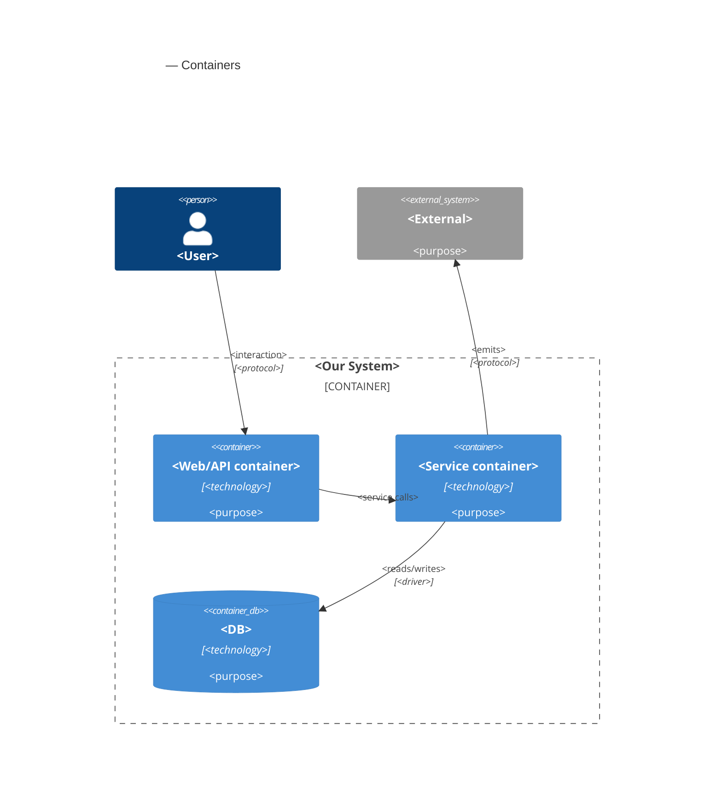
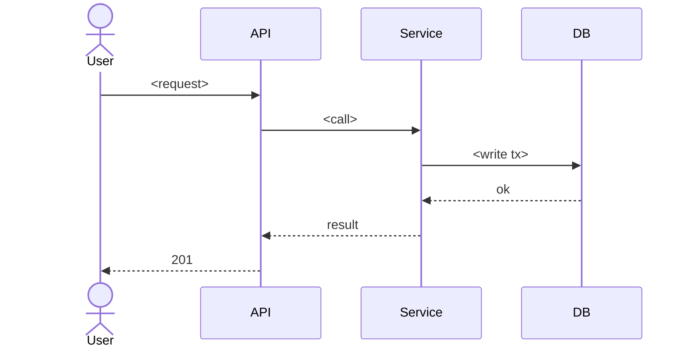

# Software Architecture Document — custom-forms

<!-- Stages 04-05 → see sdlc/plugin/skills/architecture-design/SKILL.md -->
<!-- 12 Arc42 sections. Empty sections — <!-- N/A: <one-line reason> -->. -->
<!-- C4 Context (L1) lives inline in §3. C4 Container (L2) lives inline in §5. -->
<!-- §6 Runtime view seeds the primary flow(s) here; complete-sequence-diagrams (stage 06) then -->
<!--    fills §6 with every critical flow / §5 AC — no cap. -->
<!-- Numbers in §10 come VERBATIM from PRD §6 NFR — no inventing, no rounding. -->
<!-- Заповнений приклад: див ~/sources/beerphp/beerlms/docs/features/course-lesson-mvp/sad.md -->

## 1. Introduction and goals

**Intent.** Custom-forms is the first step toward a broader no-code application-building platform. A Creator (technical, implementation-facing consultant) assembles a working form screen from a curated component library without writing code — removing the developer-queue bottleneck on screen delivery. A User fills in a Creator-published form and sees their own previously-entered values when they return. Access is governed by three roles — Admin, Creator, User — from day one.

**Top-3 quality goals (1-liners; full scenarios in §10):**

1. Rendering correctness under component-library evolution — Runtime never renders a published form blank or silently broken, even after the curated component library changes.
2. Authorization & data-isolation integrity — the three-role access boundary and per-User forms-data isolation hold under every access path.
3. Responsiveness — Designer save and Runtime render stay within their p95 latency targets.

**Stakeholders.**

| Role | Interest | Sign-off owner? |
|---|---|---|
| Admin | Governs Designer access + user roles | No |
| Creator | Assembles/publishes forms, manages schemas/templates | No |
| User | Fills published forms, owns their own submitted data | No |
| Tech Lead | SAD approval | Yes |
| Security Lead | Reviews the new authz boundary + data-isolation guarantee | Yes |

<!-- Decision overrides (¶4) — populated by the Step-7 critic resolution loop, empty otherwise.       -->
<!-- Each: «Decision override: <headline> — rationale: <reason>» so downstream skills see the choice.  -->

## 2. Constraints

**Technical.**
- Angular 21 (zoneless, Signals) + NX 22.6.1 monorepo
- `@angular-architects/native-federation` (esbuild-based Module Federation, NOT Webpack) — shell host (port 4200) + federated remotes: designer (4201), runtime (4202), user-administration (4203)
- NestJS 11 backend (`server/api`), Express platform
- Drizzle ORM 0.40 + PostgreSQL (`postgres` driver), JSONB columns for schema storage
- Auth: `@nestjs/jwt` + `passport-jwt`; `bcryptjs` (12 rounds) for password hashing
- `@nestjs/swagger` — OpenAPI docs at `/api/docs`

**Organisational.**
- Feature size **L** (`.size`) — full 12-section SAD, 10-15 ADRs expected
- Hard build-sequence constraint (PRD §1): US-01/02/03 (auth + role administration) ship before US-04+ (Designer/Runtime capabilities)
- No deadline / effort budget stated in PRD → `<TBD by PM>` (see §11 Risks)

**Conventions.**
- No repo-level `CLAUDE.md` — conventions below are inferred from the existing (brownfield) code at commit `0a09af4`, not an authored standard
- Backend: one NestJS module per domain (`app/{auth,schemas,users,drizzle}`), each with `.controller.ts` / `.service.ts` / `.module.ts` / `dto/`; services inject `DRIZZLE_DB` and use Drizzle relational queries
- Frontend: NX apps = shell (host) + federated remotes; shared libs (`http`, `auth`, `ui`, `api-client`); standalone Angular components + signals
- ID strategy: UUID v4 (`uuid('...').primaryKey().defaultRandom()`)
- DTO naming: `{Action}{Entity}Dto`

**Regulatory / external.**
- PRD §6.1: Security review **Required** — new authz boundary (3 roles), new forms-data isolation guarantee, unresolved personal-data-field question
- Data classification: internal
- Named abuse cases to defend: config injection (XSS), draft leak, cross-User forms-data leak, component-library tampering, spam screen creation (rate-limit 30 saves/min/account)

## 3. Context and scope

Custom-forms is an internal no-code tool: a Creator (or Admin) assembles a form screen from a curated component library in Designer and publishes it; a User then fills that published form in Runtime and sees their own previously-submitted values on return. Admin additionally governs who holds which role. The system is self-contained — PRD §3 explicitly puts external-system integrations and workflow automation out of scope for this iteration, and the existing auth is homegrown (JWT/passport), not an external Identity Provider.

**External systems (in / out):**

| Actor or system | Type | Interaction |
|---|---|---|
| Admin | Person | Manages user accounts/roles, uses Designer |
| Creator | Person | Assembles/publishes forms + templates in Designer |
| User | Person | Fills/revisits own forms data in Runtime |
| *(none)* | — | No external systems this iteration — deliberate (PRD §3 non-goal: workflow automation / external integrations out of scope; auth is self-hosted JWT, not an external IdP) |

**C4 Context (L1):**



## 4. Solution strategy

<!-- 🎯 Навіщо: 3-4 СТРАТЕГІЧНІ СТОВПИ, з яких потім ростуть усі ADR. Без §4 кожен ADR    -->
<!--           виглядає випадковим — нема зонтика. ⭐ Найгустіша секція — тут ADR-gate    -->
<!--           спрацьовує майже завжди (рішення незворотні + мульти-модульні).            -->
<!-- 📋 Що писати: спершу Target surface(s), потім 3-4 стратегічні вибори.                -->
<!--           На кожен — заголовок + 2-3 речення rationale.                              -->
<!-- 📌 ПЕРШЕ рішення §4 — Target surface(s): ЩО САМЕ будуємо. Записується у frontmatter   -->
<!--           target_surfaces: [...] і гейтить §5 (один контейнер на поверхню) + усі       -->
<!--           наступні стадії. Деривиться з PRD §1 «для кого» + §4 ролей. → _shared/surfaces.md -->
<!-- 📌 Приклад: «Зберігати урок як таблицю блоків» — стовп, з якого виросло ADR-0001.    -->

**Target surface(s) (the first decision — what's being built):** `<e.g. [backend-service, web-frontend]>`
<!-- Mirror this list into the frontmatter `target_surfaces`. For each declared UI surface          -->
<!-- (web-frontend / mobile-app / desktop-app) add a UI-architecture choice below (web → SSR/SPA/   -->
<!-- hybrid; mobile → native/cross-platform). Multi-surface is usually an ADR (multi-module +       -->
<!-- irreversible). The UI reuses the repo's existing design system / components / tokens from       -->
<!-- architecture-map.md §Frontend — it does not design greenfield. → _shared/surfaces.md           -->

**Top strategic choices (the seeds for ADRs):**

1. **<e.g. Module isolation through events>** — <2-3 sentences rationale referencing Quality Goals and constraints>.
2. **<e.g. Single-store persistence (Postgres)>** — <2-3 sentences>.
3. **<e.g. UI-architecture: SPA consuming the backend API>** — <per declared UI surface; 2-3 sentences>.

Each tactical decision in later sections should be traceable to one of these strategic seeds. Tactical decisions that *contradict* a strategic choice are red flags — surface them in §11 Risks.

## 5. Building block view

<!-- 🎯 Навіщо: ВНУТРІШНЯ ДЕКОМПОЗИЦІЯ — модулі, контейнери, БД. Статична топологія:   -->
<!--           хто з ким може говорити. Без §5 §6 (сценарії) не має словника учасників. -->
<!-- 📋 Що писати: 1 абзац про стиль (шари/гексагональна/clean/на подіях) +            -->
<!--           дерево папок + Mermaid C4Container.                                       -->
<!-- 📌 ОДИН Container на кожну оголошену target_surface (frontmatter): fullstack        -->
<!--           [backend-service, web-frontend] = backend-API container + web/SPA container; -->
<!--           [backend-service, mobile-app] = API + mobile app. Container(web, …) нижче — -->
<!--           лише приклад однієї поверхні; додай/заміни під оголошене у §4. → _shared/surfaces.md -->
<!-- 📌 Приклад: «web-app, content-api, media-worker, postgres, s3, cdn».                -->

<One paragraph: layered / hexagonal / clean / event-driven. Why.>

**Internal decomposition:**

```
<e.g. internal/modules/goals/>
├── domain/       <entities + sentinel errors>
├── app/          <use cases / services>
├── infra/        <repository + outbox impl>
├── ports/        <HTTP handlers, DTOs, error mapping>
└── module.go     <self-wiring>
```

**C4 Container (L2):**



## 6. Runtime view

<!-- 🎯 Навіщо: ПОТІК У RUNTIME для 1-2 критичних сценаріїв. Хто з ким коли і у якому     -->
<!--           порядку говорить. Без §6 §5 — лише купа коробок без життя.                  -->
<!-- 📋 Що писати: Mermaid sequenceDiagram. Учасники — імена з §5 (не вигадуй нові!).      -->
<!--           Повідомлення семантичні («складає чорновик»), БЕЗ HTTP-методів/шляхів —     -->
<!--           ендпоінт-рівневі sequence-діаграми зʼявляться у stage 06 (api-forge).        -->
<!-- ⏳ RESERVED FOR SEQUENCES: architecture-design сіє лише primary flow(s) тут.          -->
<!--           complete-sequence-diagrams (stage 06) ДОПОВНЮЄ §6 кожним критичним flow /    -->
<!--           кожним §5 AC — без обмеження. Не намагайся покрити все тут.                  -->
<!-- 📌 Приклад: «methodist → web-app: складає чорновик → web-app → content-api: зберегти». -->

**Critical flow 1: <flow name>**



<!-- For XS/S: 1 flow above is enough. For M+: add 2-4 more (e.g. failure-mode flow, async flow). -->

**Critical flow 2: <e.g. async event propagation>** — <if applicable, otherwise N/A>.

## 7. Deployment view

<!-- 🎯 Навіщо: ТОПОЛОГІЯ, яку DevOps має знати без читання Helm-чартів — скільки реплік,  -->
<!--           де живе фоновий обробник, ПРИ ЯКИХ ЧИСЛАХ масштабуємось.                     -->
<!-- 📋 Що писати: 2-3 речення про топологію + метрики + алерти + конкретні числа-пороги.   -->
<!-- 📌 Приклад: «500 IC → партиціонування за кварталом» (не «при зростанні подумаємо»).    -->
<!-- 🎯 Можна N/A для XS/S функцій, що переюзають існуюче розгортання без змін.            -->

<Topology in 2-3 sentences. Where it runs (k8s / VM / serverless), replicas, scaling thresholds.>

**Monitoring:**
- <Metrics — e.g. Prometheus `<metric_name>`>
- <Alerts — e.g. "outbox lag > 10 min → page on-call">
- <Tracing — e.g. OpenTelemetry HTTP spans>

**Scaling thresholds:**
- <e.g. 500 IC × 5 goals × 26 checkpoints/Q = 65k rows/year — comfortable in one table>
- <e.g. partitioning by quarter at >500k rows/year>

<!-- For XS/S that doesn't change deployment: <!-- N/A: feature reuses existing deployment unit -->. -->

## 8. Crosscutting concepts

<!-- 🎯 Навіщо: НАСКРІЗНІ ПАТЕРНИ, які перетинають кілька модулів: логування, помилки,    -->
<!--           авторизація, ID strategy, outbox, кеш. ⭐ Друга найгустіша секція.          -->
<!--           Якщо патерн всередині одного модуля — він НЕ сюди. Якщо це конвенція        -->
<!--           проєкту в цілому — у CLAUDE.md.                                              -->
<!-- 📋 Що писати: таблиця концепт / конвенція / де визначено. Один рядок на концепт.      -->
<!-- 📌 Приклад: «UUID v7 (час+випадковий, сортується) у app-layer» — як default з CLAUDE.md. -->

| Concept | Convention | Where defined |
|---|---|---|
| Logging | <e.g. structured slog, fields `module=<name>`> | <CLAUDE.md §X or here> |
| Authentication | <e.g. JWT via session middleware> | <CLAUDE.md §X> |
| Error handling | <e.g. domain sentinel → ports/errors.go → apperr JSON> | <CLAUDE.md §X> |
| ID strategy | <e.g. UUID v7 in app layer> | <CLAUDE.md §X> |
| Internationalisation | <e.g. N/A, English only> | — |
| Observability | <e.g. OpenTelemetry on HTTP boundaries> | — |
| Outbox / events | <module-specific patterns, if any> | <here> |

## 9. Architecture decisions

<!-- 🎯 Навіщо: ЗВОРОТНИЙ ІНДЕКС на папку adr/. `ls adr/` дає файли, §9 дає семантику —    -->
<!--           чому вони існують, до якого зрізу SAD привʼязані, у якому статусі.           -->
<!-- 📋 Що писати: таблиця з 4 колонками. Один рядок на ADR. Mixed status — це OK.         -->
<!-- 📌 Приклад: «0001 | Зберігати урок як таблицю блоків | Accepted | §4».                -->

| # | Title | Status | Section |
|---|---|---|---|
| <NNNN> | <imperative — e.g. "Use sliding window for rate limiting"> | Accepted | §<N> |
| <NNNN> | <imperative — e.g. "Co-locate outbox worker in API process"> | Accepted | §<N> |

ADR files live under `docs/features/<slug>/adr/NNNN-<title>.md`.

## 10. Quality requirements

<!-- 🎯 Навіщо: ДЕРЕВО ЯКОСТЕЙ (Quality Tree) — беремо мету з §1 і розкладаємо на          -->
<!--           конкретні листя: тести, метрики, конфіги, drill-и. ⭐ Без §10 §1 — це       -->
<!--           маніфест. З §10 кожна декларація мапиться на щось, ЩО МОЖНА ДОВЕСТИ.        -->
<!-- 📋 Що писати: на кожну якість з §1 — When / Then / How verify. Числа з PRD §6 NFR     -->
<!--           ДОСЛІВНО (не округлюй p95 ≤250мс до ≤300мс — це F6-помилка критика).        -->
<!-- 📌 Приклад: «p95 ≤500 мс на UPDATE блоку, перевіримо k6 load test 100 req/s».        -->

Each top-3 goal from §1 expanded into a full scenario:

**QG-1. <quality attribute>**
- **When:** <trigger condition>
- **Then:** <expected behavior with numbers from PRD NFR>
- **How verify:** <test / chaos drill / load test / observability>

**QG-2. <quality attribute>**
- **When:** <trigger>
- **Then:** <expected>
- **How verify:** <how>

**QG-3. <quality attribute>**
- **When:** <trigger>
- **Then:** <expected>
- **How verify:** <how>

## 11. Risks and technical debt

<!-- 🎯 Навіщо: ⭐ збирає ВСЕ, що може зламатись — і не лише технічне. Без §11 ризики   -->
<!--           обговорюються на стендапах і губляться; борг лишається у голові того,    -->
<!--           хто його прийняв.                                                          -->
<!-- 📋 Що писати: таблиця ризик/борг — серйозність — мітигація — власник. Технічний    -->
<!--           борг окремою секцією.                                                      -->
<!-- 📌 Приклад: «EM не пушить — member не оновлює дані | High | …». Перший ризик —      -->
<!--           часто продуктовий, не технічний. Це нормально.                            -->

<!-- Severity column literals: Low / Medium / High for regular risks; "Open question" for rows
     created by Step-7 `Save as Open Question` resolutions (see references/socratic-loop.md). -->

| Risk / debt | Severity | Mitigation | Owner |
|---|---|---|---|
| <e.g. Outbox lag may reach hours during downstream outage> | Medium | <Alert >10 min, on-call playbook, retry backoff> | <DevOps> |
| <e.g. No event schema versioning in v1> | Medium | <ADR-NNNN planned for v2, graceful handling of unknown fields> | <Backend> |
| Open architectural decision: <decision-headline> | Open question | Resolve before <stage trigger or YYYY-MM-DD>; <inline rationale from Step-7 Save-as-OQ> | <owner> |

**Accepted debt (acceptable in v1, plan to fix later):**
- <e.g. Goal entity is not versioned (immutable) — OK for v1, may need audit versioning in v2>

## 12. Glossary

<!-- 🎯 Навіщо: ⭐ СЛОВНИК ДОМЕНУ, який припиняє суперечки через рік («checkpoint —      -->
<!--           weekly чи biweekly? Quarter — календарний чи фіскальний?»).                -->
<!-- 📋 Що писати: таблиця термін / значення. Бізнес-терміни + технічні вперемішку.       -->
<!--           Один термін може мати дві мови у заголовку: «Goal (Обʼєктив)».              -->
<!-- 📌 Приклад: «Lesson | урок усередині курсу, що складається з блоків (text, video)». -->

| Term | Meaning |
|---|---|
| <e.g. Goal> | <quarterly intent in statement form> |
| <e.g. KR> | <Key Result — measurable target linked to a Goal> |
| <e.g. Checkpoint> | <bi-weekly progress update on a KR> |
