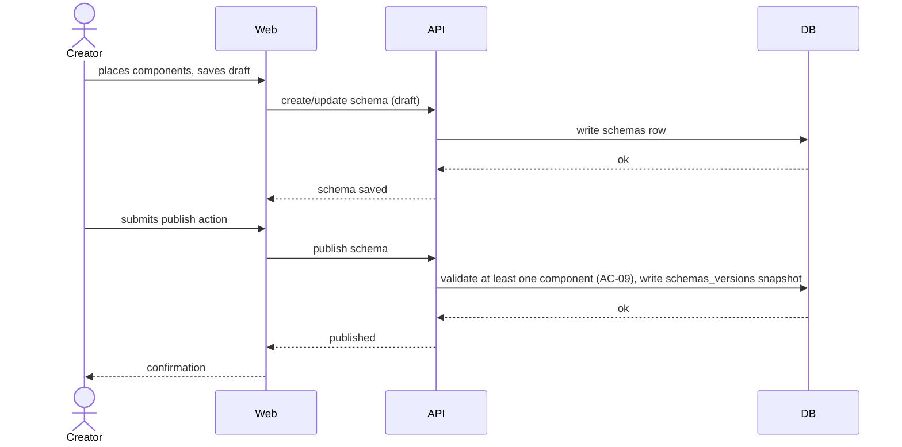
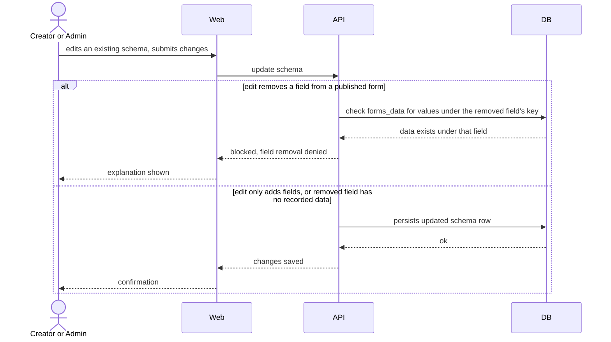

# Software Architecture Document — designer/forms-editor

> **Split note (2026-08-28):** extracted from the original `custom-forms` sad.md. See [designer overview](../sad.md) for the parent Designer context, constraints, and ADRs.

## 1. Introduction and goals

A Creator (or Admin) places curated components onto a canvas, configures them, and publishes the resulting form schema.

## 5. Building block view

`schemas` module gains a field-removal guard (AC-10b): before allowing a field removal, `schemas.service` asks `forms-data.service` (owned by the runtime feature) whether any submitted row has a value under that field's key.

**Frontend:** `client/apps/designer/src/app/form-editor/` — canvas/palette/properties-panel.

## 6. Runtime view

**Flow: Creator assembles and publishes a form**

**Flow: Edit a schema after publish, blocked by recorded data (AC-10b)**

## 9. Architecture decisions

See [designer overview](../sad.md) §9 (ADR-0001, ADR-0002).

## 10. Quality requirements

**Rendering correctness under component-library evolution (published draft here, verified end-to-end in runtime)**

- **When:** a published form's configuration includes a component that fails to render.
- **Then:** the system shows a visible error placeholder instead of a blank screen or uncaught error (see [runtime sad.md](../../runtime/sad.md) §10 for the full scenario — the failure surfaces at render time, not save time).

## Related

- [designer overview](../sad.md)
- `docs/adr/0001-dedicated-forms-data-and-templates-tables.md`
