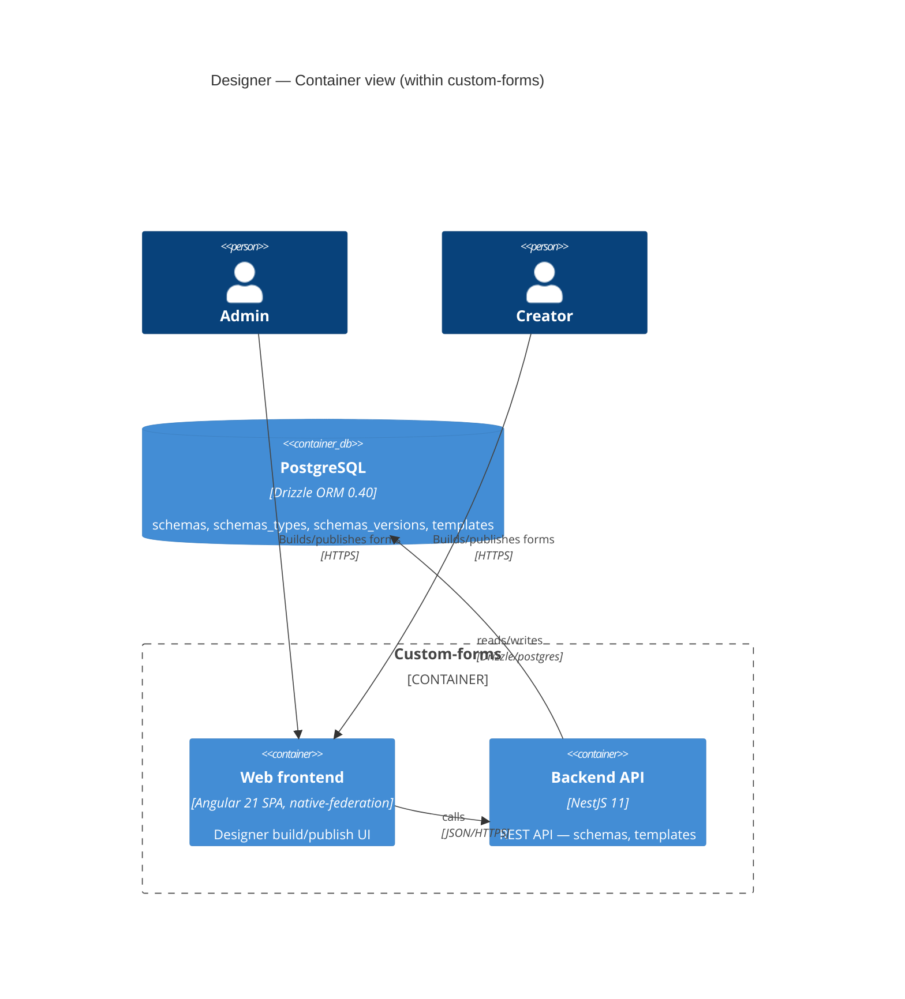

# Software Architecture Document — designer

> **Split note (2026-08-28):** extracted from the original `custom-forms` sad.md. This is an **overview-only** document — flow-level detail (sequence diagrams, per-flow ACs) lives in each sub-feature's sad.md: [forms-editor](./forms-editor/sad.md), [schema-viewer](./schema-viewer/sad.md), [template-actions](./template-actions/sad.md).

## 1. Introduction and goals

Designer is where a Creator (or Admin) assembles a form screen from a curated component library and publishes it — removing the developer-queue bottleneck on screen delivery.

**Quality goal:** Rendering correctness under component-library evolution — Runtime never renders a published form blank or silently broken, even after the curated component library changes (full scenario in the runtime feature's sad.md §10, since the failure surfaces there).

## 2. Constraints

See `docs/PROJECT.md` and `docs/adr/` for project-wide constraints. Designer-specific: schema storage uses JSONB columns on the existing `schemas` table (`type = form`).

## 3. Context and scope

A Creator (or Admin) assembles a form screen from a curated component library in Designer and publishes it. Designer never surfaces forms data (the values Users submit) — only schema/template design metadata (see schema-viewer AC-12).

## 4. Solution strategy

**Strategic seeds:**

1. **Dedicated `forms_data` + `templates` tables** (→ `docs/adr/0001-dedicated-forms-data-and-templates-tables.md`) — templates (template-actions AC-24: independent copy, no ongoing link to source) are a new entity absent from the brownfield's `schemas`/`schemas_versions` tables.
2. **Per-endpoint `@Roles()` + `RolesGuard`** (→ `docs/adr/0002-per-endpoint-roles-guard-for-authorization.md`) — Designer access is limited to Admin + Creator.

## 5. Building block view

Backend stays a layered NestJS module-per-domain style. One new module lands per ADR-0001's table split: `templates`. The existing `schemas` module gains a cross-module read into `forms-data` (owned by the runtime feature) to enforce the field-removal guard (forms-editor AC-10b).

**Backend (`server/api/src/app/`):**

```
app/
├── schemas/       <existing, extended — + field-removal guard reads forms-data>
├── templates/     <NEW (ADR-0001) — named independent schema copies>
```

**Frontend (`client/apps/designer/src/app/`):**

```
designer/src/app/
├── form-list/            <existing, extended — also lists templates; see schema-viewer>
├── form-editor/          <existing — canvas/palette/properties-panel; see forms-editor>
├── schema-viewer/        <existing; see schema-viewer>
└── template-actions/     <NEW — save-as-template, create-from-template; see template-actions>
```

**C4 Container (L2) — Designer's place in the system:**



## 6. Runtime view

Seeded here at the parent level; each sub-feature's sad.md §6 holds its own flows:

- forms-editor: Creator assembles and publishes a form
- schema-viewer: browse and view schemas/templates
- template-actions: save-as-template, create-from-template, edit, delete

## 7. Deployment view

<!-- N/A: shared project-wide deployment topology, see docs/adr/0003-docker-compose-single-vm-production-deployment.md -->

## 8. Crosscutting concepts

| Concept                     | Convention                                                                                                             | Where defined     |
| --------------------------- | ---------------------------------------------------------------------------------------------------------------------- | ----------------- |
| Rate limiting _(new)_       | 30 screen-save actions/min/account via `@nestjs/throttler`                                                             | new, this feature |
| Config sanitization _(new)_ | Text/link component values rendered via Angular's default template binding, never `[innerHTML]`/`bypassSecurityTrust*` | new, this feature |
| ID strategy                 | UUID v4, applied to `templates` too                                                                                    | Drizzle schema    |

## 9. Architecture decisions

| #                                                                    | Title                                                                  | Status   |
| -------------------------------------------------------------------- | ---------------------------------------------------------------------- | -------- |
| [0001](../../adr/0001-dedicated-forms-data-and-templates-tables.md)  | Store forms data and templates as two dedicated tables                 | Accepted |
| [0002](../../adr/0002-per-endpoint-roles-guard-for-authorization.md) | Enforce the three-role model with a per-endpoint @Roles() + RolesGuard | Accepted |

## 10. Quality requirements

See sub-feature sad.md files for per-flow scenarios; the "Rendering correctness under component-library evolution" quality goal is verified end-to-end in Runtime (its failure mode only manifests there).

## 11. Risks and technical debt

| Risk / debt                                                                                                              | Severity      | Mitigation                                                                                              | Owner                 |
| ------------------------------------------------------------------------------------------------------------------------ | ------------- | ------------------------------------------------------------------------------------------------------- | --------------------- |
| Open architectural decision: final curated component list for first release                                              | Open question | Resolve before `/sdlc-break-tasks designer`; default now is the 4 named types (Text/Number/Select/Date) | Oleksandr Vorovchenko |
| Every new backend endpoint must remember to add `@Roles()` manually — no structural/lint guarantee against forgetting it | Low           | Accepted debt (ADR-0002 negative consequence)                                                           | Backend               |

## 12. Glossary

Extracted from `docs/CONTEXT.md` §Glossary.

| Term         | Meaning                                                                                                                                                                                                       |
| ------------ | ------------------------------------------------------------------------------------------------------------------------------------------------------------------------------------------------------------- |
| Designer     | The no-code app where a Creator/Admin assembles a form/page from the curated component library, saving the result as config. NOT a visual/graphic UI designer role, and NOT this architecture document (SAD). |
| forms schema | A JSON-Schema-based definition of a form/screen's fields and layout, assembled by a Creator in Designer. NOT forms data.                                                                                      |
| template     | A named, reusable copy of a forms schema. NOT forms schema — a forms schema belongs to one specific screen; a template is a separate, reusable entity.                                                        |

## Related

- `docs/PROJECT.md` — project-level scope and cross-feature index
- `docs/adr/0001-dedicated-forms-data-and-templates-tables.md`
- `docs/adr/0002-per-endpoint-roles-guard-for-authorization.md`
