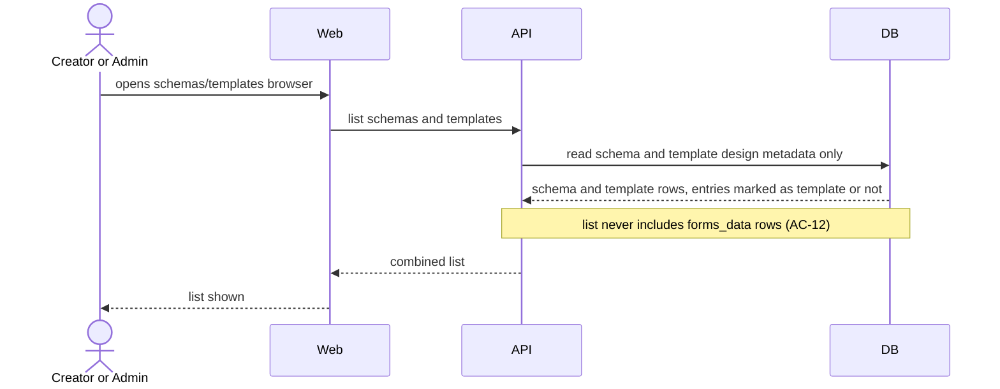
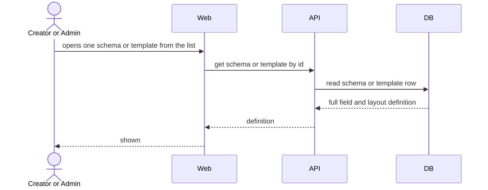

# Software Architecture Document — designer/schema-viewer

> **Split note (2026-08-28):** extracted from the original `custom-forms` sad.md. See [designer overview](../sad.md) for the parent Designer context, constraints, and ADRs.

## 1. Introduction and goals

Creator/Admin browse and view existing forms schemas and templates via a fixed, built-in list + detail view.

## 5. Building block view

**Frontend:** `client/apps/designer/src/app/form-list/` — existing, extended to also list templates (AC-11).

## 6. Runtime view

**Flow: Browse schemas and templates list (US-05)**

**Flow: View a single schema or template (US-06)**

## 9. Architecture decisions

See [designer overview](../sad.md) §9 (ADR-0001, ADR-0002).

## Related

- [designer overview](../sad.md)
