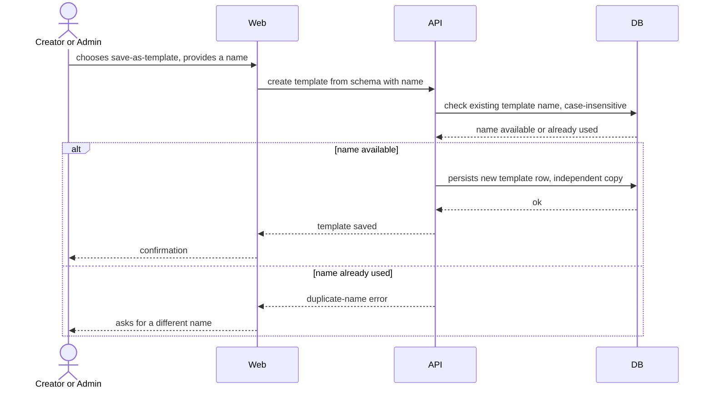
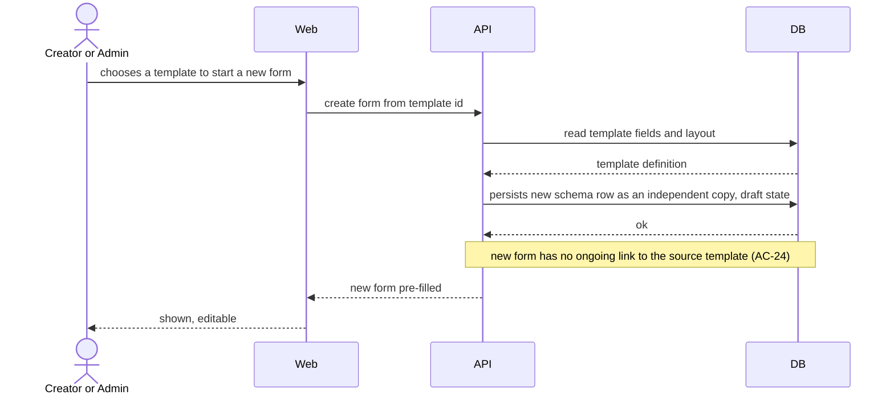
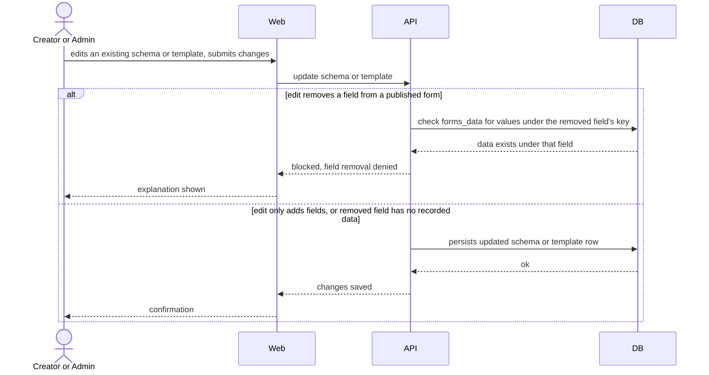
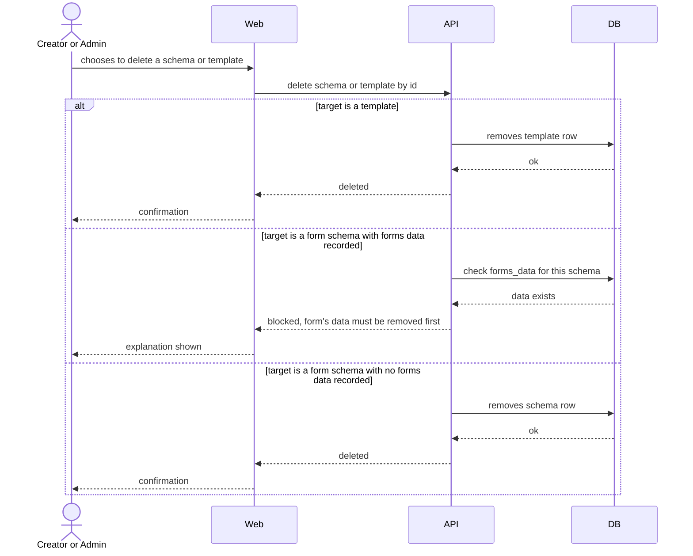

# Software Architecture Document — designer/template-actions

> **Split note (2026-08-28):** extracted from the original `custom-forms` sad.md. See [designer overview](../sad.md) for the parent Designer context, constraints, and ADRs.

## 1. Introduction and goals

Creator/Admin save a schema as a template, start a new form from a template, and edit/delete schemas or templates.

## 4. Solution strategy

**Strategic seed:** Dedicated `templates` table (→ `docs/adr/0001-dedicated-forms-data-and-templates-tables.md`) — templates (AC-24: independent copy, no ongoing link to source) are a new entity absent from the brownfield's `schemas`/`schemas_versions` tables; a dedicated table keeps the independent-copy invariant native rather than overloading `schemas`.

## 5. Building block view

**Backend:** `server/api/src/app/templates/` — NEW (ADR-0001), named independent schema copies (AC-21/AC-24).

**Frontend:** `client/apps/designer/src/app/template-actions/` — NEW, save-as-template / create-from-template.

## 6. Runtime view

**Flow: Save a schema as a template (US-08)**

**Flow: Create a new form from a template (US-09)**

**Flow: Edit a schema or template (US-10)**

**Flow: Delete a schema or template (US-10)**

## 9. Architecture decisions

| #                                                                   | Title                                                  | Status   |
| ------------------------------------------------------------------- | ------------------------------------------------------ | -------- |
| [0001](../../adr/0001-dedicated-forms-data-and-templates-tables.md) | Store forms data and templates as two dedicated tables | Accepted |

## 12. Glossary

| Term     | Meaning                                                                                              |
| -------- | ---------------------------------------------------------------------------------------------------- |
| template | A named, reusable copy of a forms schema that a Creator or Admin explicitly saves. NOT forms schema. |

## Related

- [designer overview](../sad.md)
- [runtime sad.md](../../runtime/sad.md) — `forms_data` cross-module read used by the delete-blocked-by-data checks above
