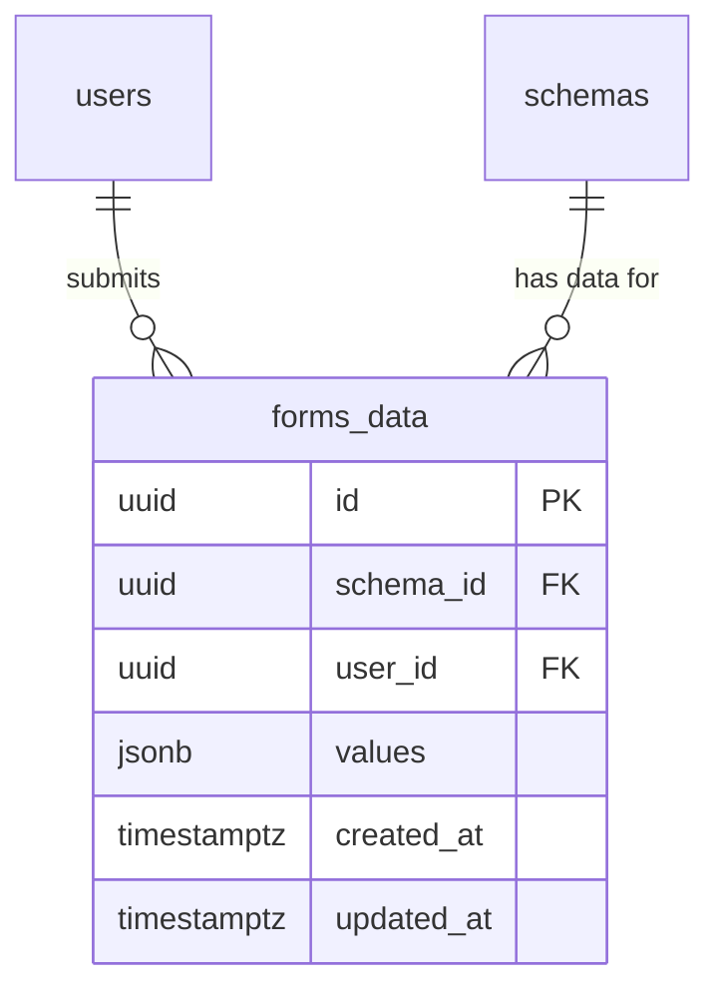

# Data model — runtime

## ER diagram

## Entities

### `forms_data`

| Column       | Type        | Constraints                                    | Notes                                                             |
| ------------ | ----------- | ---------------------------------------------- | ----------------------------------------------------------------- |
| `id`         | uuid        | PK, `DEFAULT gen_random_uuid()`                | matches `schemas`/`users` PK style                                |
| `schema_id`  | uuid        | NOT NULL, FK → `schemas(id)` ON DELETE CASCADE | a schema's forms data goes away with the schema (ADR-0001 scope)  |
| `user_id`    | uuid        | NOT NULL, FK → `users(id)` ON DELETE CASCADE   | a deleted account's forms data goes away with it                  |
| `values`     | jsonb       | NOT NULL                                       | the submitted field values, keyed like the schema's component ids |
| `created_at` | timestamptz | NOT NULL DEFAULT now()                         | matches repo audit-column pattern                                 |
| `updated_at` | timestamptz | NOT NULL DEFAULT now()                         | bumped on every upsert-resubmit (AC-17)                           |

**Aggregate root:** `forms_data` (owned jointly by `schemas` and `users`; no children).
**Access patterns:**

- prefill/read own data for a form (AC-19, AC-20) → `WHERE schema_id = ? AND user_id = ?` → served by the unique composite index below.
- upsert on submit (AC-17) → same composite key, `ON CONFLICT (schema_id, user_id) DO UPDATE`.
- cascade delete when a user is removed → FK index on `user_id`.

**Constraints:** UNIQUE `(schema_id, user_id)` — one forms-data record per User per form (AC-17, not a history); FK → `schemas(id)` ON DELETE CASCADE; FK → `users(id)` ON DELETE CASCADE.

## Indexes

| Index                                 | Columns                | Query it serves                                                                                   |
| ------------------------------------- | ---------------------- | ------------------------------------------------------------------------------------------------- |
| `forms_data_schema_id_user_id_unique` | `(schema_id, user_id)` | prefill/read/upsert/delete own forms data (AC-17/19/20/29) — also covers `schema_id`-only lookups |
| `forms_data_user_id_idx`              | `(user_id)`            | FK index for the `users(id)` cascade-delete path (self-check: every FK indexed)                   |

## Test fixtures

- `buildFormsData({ schemaId, userId, values })` — factory in `server/api/src/app/forms-data/forms-data.service.spec.ts`, matching the existing `schemas`/`users` builder style already used in sibling specs; no fixture data goes into `migrations/`.
