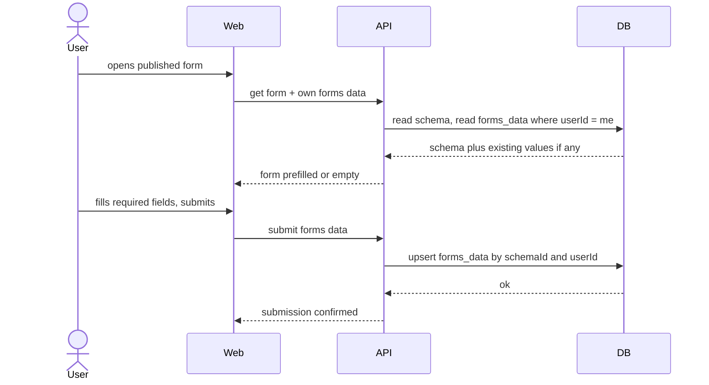
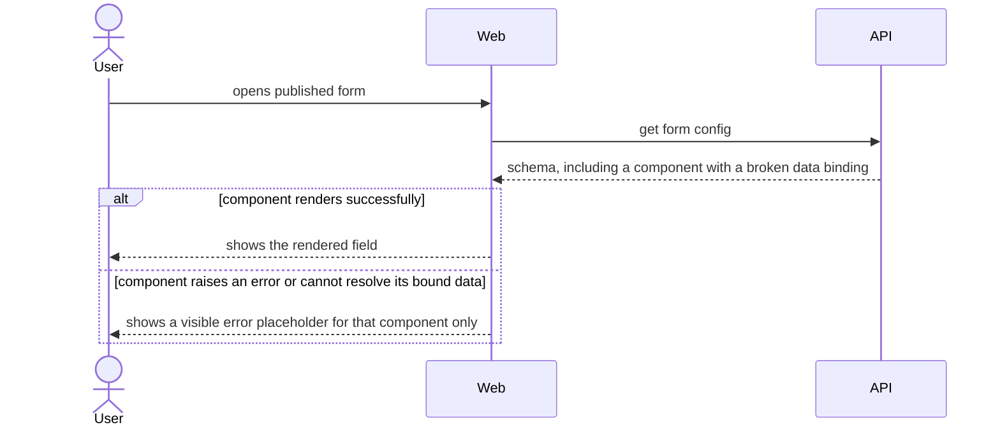
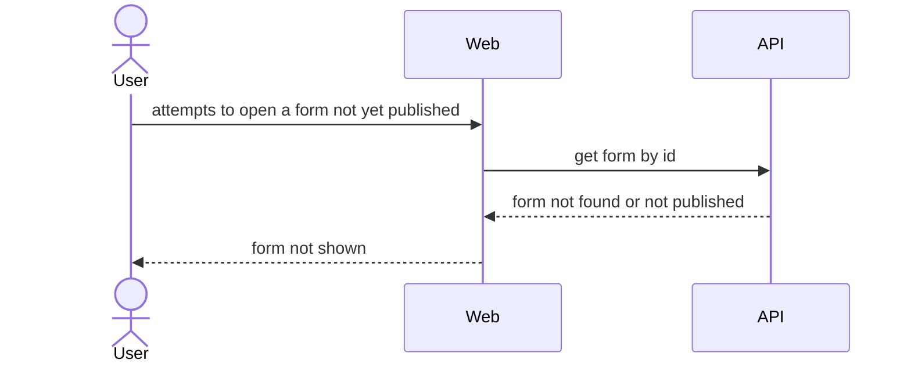
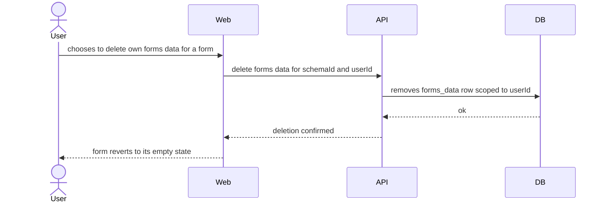
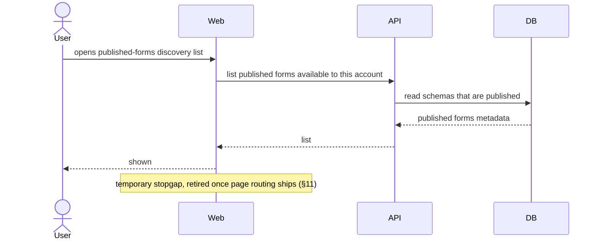

# Software Architecture Document — runtime

> **Split note (2026-08-28):** extracted from the original `custom-forms` sad.md when the project docs were reorganized into `docs/PROJECT.md` + per-feature docs. Content below is unchanged from that sad.md, not re-derived.

## 1. Introduction and goals

A User fills in a Creator-published form and sees their own previously-entered values when they return.

**Quality goal:** Rendering correctness under component-library evolution — Runtime never renders a published form blank or silently broken, even after the curated component library changes (this is where the failure mode actually surfaces, even though the component library itself is owned by designer/forms-editor).

## 2. Constraints

See `docs/PROJECT.md` and `docs/adr/` for project-wide constraints.

## 3. Context and scope

A User fills a published form in Runtime and sees their own previously-submitted values on return.

## 4. Solution strategy

**Strategic seed:** Dedicated `forms_data` table (→ `docs/adr/0001-dedicated-forms-data-and-templates-tables.md`) — forms data (AC-17: one row per User per form, upsert not history) is a new entity absent from the brownfield's `schemas`/`schemas_versions` tables.

## 5. Building block view

**Backend:** `server/api/src/app/forms-data/` — NEW (ADR-0001), per-User submitted values, upsert-on-resubmit (AC-17).

**Frontend (`client/apps/runtime/src/app/`, currently empty routes, filled this iteration):**

```
runtime/src/app/
├── form-list/            <NEW — AC-30 temporary discovery list of published forms>
└── form-viewer/          <NEW — render, fill, prefill own data, delete own data>
```

## 6. Runtime view

**Flow: User fills, submits, and later returns to a published form**



**Flow: Runtime shows a visible error placeholder for a broken component (AC-16)**



**Flow: Runtime blocks access to an unpublished form (AC-14)**



**Flow: User deletes own forms data (AC-29)**



**Flow: User discovers published forms (AC-30)**



## 7. Deployment view

<!-- N/A: shared project-wide deployment topology, see docs/adr/0003-docker-compose-single-vm-production-deployment.md -->

## 8. Crosscutting concepts

| Concept             | Convention                                                                                                             | Where defined                                                      |
| ------------------- | ---------------------------------------------------------------------------------------------------------------------- | ------------------------------------------------------------------ |
| Config sanitization | Text/link component values rendered via Angular's default template binding, never `[innerHTML]`/`bypassSecurityTrust*` | shared with designer, see [designer sad.md](../designer/sad.md) §8 |
| ID strategy         | UUID v4, applied to `forms_data` too                                                                                   | Drizzle schema                                                     |

## 9. Architecture decisions

| #                                                                   | Title                                                  | Status   |
| ------------------------------------------------------------------- | ------------------------------------------------------ | -------- |
| [0001](../../adr/0001-dedicated-forms-data-and-templates-tables.md) | Store forms data and templates as two dedicated tables | Accepted |

## 10. Quality requirements

**Rendering correctness under component-library evolution**

- **When:** a published form's configuration includes a component that fails to render (an uncaught error, or the component cannot resolve its bound data — AC-16's definition).
- **Then:** the system shows a visible error placeholder for that component instead of a blank screen or uncaught error. NFR target (designer PRD §6, verbatim): "0 published forms render blank or break silently in Runtime after a curated-library change." KPI target (runtime PRD §7, verbatim): "≥95% of published forms render without a rendering error... tracked over the first 30 days post-release."
- **How verify:** manual regression check across all published forms whenever a component in the library changes; plus an automated test asserting the error-placeholder flow's fallback renders for a mocked broken binding.

**Authorization & data-isolation integrity**

- **When:** two accounts (any roles, including Admin/Creator) have each submitted forms data for the same published form.
- **Then:** each account sees only its own forms data, never another's, even across roles (AC-20).
- **How verify:** a cross-account forms-data isolation test asserting account B's read never returns account A's submitted values.

**Responsiveness**

- **When:** a Runtime screen renders.
- **Then:** Runtime screen render p95 ≤ 300 ms; throughput ≥ 5 req/s per instance.
- **How verify:** client-side render timing telemetry; smoke test in CI for throughput.

## 11. Risks and technical debt

| Risk / debt                                                                                                                                                                                                  | Severity      | Mitigation                                                                            | Owner   |
| ------------------------------------------------------------------------------------------------------------------------------------------------------------------------------------------------------------ | ------------- | ------------------------------------------------------------------------------------- | ------- |
| Component-library-change safety relies solely on AC-16's error-placeholder fallback + a manual regression check — no automated version-pinning or backward-compatibility layer for components this iteration | Accepted debt | Revisit if config-migration incidents occur                                           | Backend |
| All `forms_data` values are classified uniformly as "internal" — no per-field PII tagging or special retention handling this iteration                                                                       | Accepted debt | Revisit if a Creator-built form is later confirmed to capture regulated personal data | Backend |
| No observability stack (metrics/alerts/tracing) in the brownfield                                                                                                                                            | Medium        | Wire up basic HTTP metrics/logging before production rollout                          | Backend |

## 12. Glossary

Extracted from `docs/CONTEXT.md` §Glossary.

| Term       | Meaning                                                                                                                                                                                             |
| ---------- | --------------------------------------------------------------------------------------------------------------------------------------------------------------------------------------------------- |
| Runtime    | The part of the custom-forms system that renders a screen/form from the config saved in Designer, dynamically instantiating Angular components. NOT the generic technical term "runtime".           |
| forms data | The specific instance of values a given User has entered into a published forms schema; stored separately from the forms schema, so a User sees exactly their own data on return. NOT forms schema. |

## Related

- `docs/PROJECT.md` — project-level scope and cross-feature index
- [designer overview](../designer/sad.md) — forms schema / component library this feature renders
- `docs/adr/0001-dedicated-forms-data-and-templates-tables.md`
