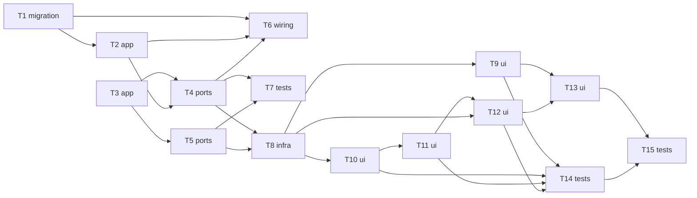

# Epic — runtime

> **Requirements:** [PRD.md](../PRD.md) (this project's spec equivalent) · **Design:** [sad.md](../sad.md) · **ADRs:** [adr/0001](../../../adr/0001-dedicated-forms-data-and-templates-tables.md), [adr/0002](../../../adr/0002-per-endpoint-roles-guard-for-authorization.md)

**Size:** M — new backend module (`forms-data`), a new DB table/migration, and a new frontend surface (`client/apps/runtime`, currently empty routes) — dominant signal: new module + new API + migration, even though the PR count sits closer to the S/M border.

**Target surfaces:** `backend-service`, `web-frontend` (per `sad.md` frontmatter) → task layers include `ui`.

## Goal

Ship the `forms-data` backend module plus the Runtime frontend surface so a User can discover, fill, submit, and revisit their own published-form data (PRD §2 Goals), with unpublished forms hidden and every User's data isolated from every other account.

## Scope

- **In:** `server/api/src/app/forms-data/` (new module), a `findPublishedById` addition to the existing `schemas` module, `client/apps/runtime/src/app/` (`form-list`, `form-viewer`), the `forms_data` DB table + migration, `client/libs/api-client` regeneration.
- **Out (PRD §3):** page routing/navigation between multiple built screens; any cross-account/shared view of forms data (Designer never surfaces forms data at all).

## Task map

Validated via structural lint: fences matched, `flowchart` recognized, every node declared before use, brackets balanced, no leftover placeholders.

## Tasks

See [tracker.md](./tracker.md) for status. Machine contract: [tasks.json](../tasks.json).

| #   | Task                                                      | Layer     | Blocked by        | DoD (short)                                                       |
| --- | --------------------------------------------------------- | --------- | ----------------- | ----------------------------------------------------------------- |
| T1  | `forms_data` table + Drizzle schema                       | migration | —                 | migration applies and reverts cleanly                             |
| T2  | `FormsDataService` (prefill / upsert submit / delete own) | app       | T1                | isolation + upsert unit tests pass                                |
| T3  | `SchemasService.findPublishedById` (AC-14 gate)           | app       | —                 | unpublished lookup throws not-found                               |
| T4  | `FormsDataController` + DTOs                              | ports     | T2, T3            | handlers return spec'd outcomes for AC-14/17/18/19/20/29          |
| T5  | Published-forms discovery endpoint (AC-30)                | ports     | T3                | endpoint lists only published forms                               |
| T6  | `FormsDataModule` wiring                                  | wiring    | T1, T2, T4        | app boots with the new module                                     |
| T7  | Backend `forms-data` tests                                | tests     | T4, T5            | isolation/validation/publish-gate tests pass                      |
| T8  | Regenerate `api-client`                                   | infra     | T4, T5            | typed client exposes the new endpoints                            |
| T9  | Runtime `form-list` screen (AC-30)                        | ui        | T8                | discovery list renders published forms                            |
| T10 | Runtime `form-viewer` renderer (AC-15/16)                 | ui        | T8                | broken component shows error placeholder, not a blank screen      |
| T11 | `form-viewer` validation (AC-18)                          | ui        | T10               | invalid submit is blocked with field-level errors                 |
| T12 | `form-viewer` data wiring (AC-17/19/29)                   | ui        | T11, T8           | submit/prefill/delete round-trip the API                          |
| T13 | Runtime routing + shell wiring                            | ui        | T9, T12           | User can navigate shell → Runtime → a form                        |
| T14 | Frontend `runtime` tests                                  | tests     | T9, T10, T11, T12 | component tests cover prefill/submit/validation/error-placeholder |
| T15 | Runtime e2e (Playwright)                                  | tests     | T13, T14          | happy path + validation-block + unpublished-hidden pass headless  |

## Risks / Hard rules

- **AC-15 / sad §8:** component values render via Angular template binding only — never `[innerHTML]` / `bypassSecurityTrust*`. Any `form-viewer` task that introduces raw HTML injection violates this.
- **AC-20 / sad §10 Authorization & data-isolation integrity:** every forms-data query must scope by `userId` — a query missing that filter is a data-isolation bug, not a style nit.
- **sad §11 accepted debt:** no per-field PII tagging and no component-version-pinning this iteration — do not scope-creep either into this epic's tasks.
- **PRD §8 open question:** personal-data classification for Creator-defined fields is still open — flag if a task's shape depends on the answer (none currently do).
