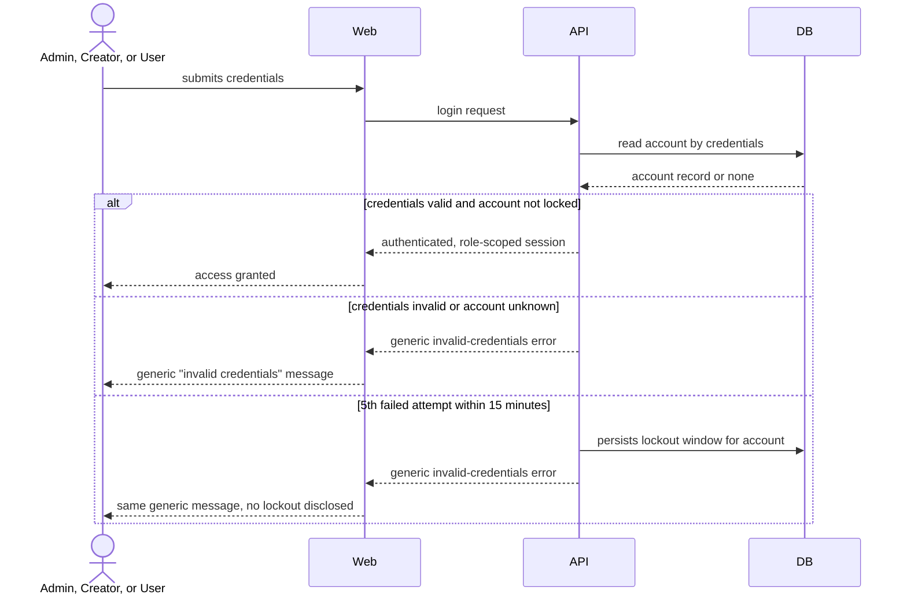
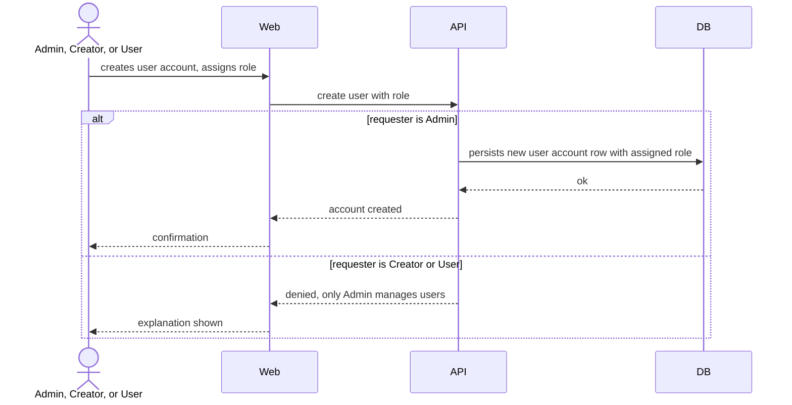
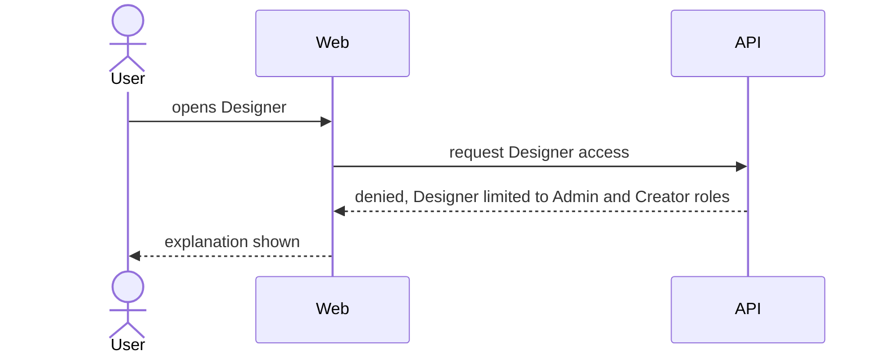

# Software Architecture Document — user-administration

> **Split note (2026-08-28):** extracted from the original `custom-forms` sad.md when the project docs were reorganized into `docs/PROJECT.md` + per-feature docs. Content below (auth-relevant portions) is unchanged from that sad.md, not re-derived. Project-wide constraints, deployment view, and cross-cutting concepts that apply to every feature live in `docs/PROJECT.md` and `docs/adr/`.

## 1. Introduction and goals

An Admin governs who can log in and which of the three roles (Admin, Creator, User) each account holds; Designer is reachable only by Admin and Creator accounts.

**Quality goal:** Authorization integrity — the three-role access boundary holds under every access path (part of the project-wide QG-2 in the retired custom-forms sad.md; see docs/PROJECT.md).

## 2. Constraints

See `docs/PROJECT.md` and `docs/adr/0002-per-endpoint-roles-guard-for-authorization.md` for the project-wide technical/organisational constraints (Angular/NestJS/Drizzle stack, module-per-domain backend convention, DTO naming, UUID v4 ID strategy). No user-administration-specific constraints beyond those.

## 3. Context and scope

An Admin manages user accounts/roles and uses Designer; Creator and User accounts authenticate to reach their role-permitted parts of the system. No external systems — auth is homegrown (JWT/passport), not an external Identity Provider.

## 4. Solution strategy

**Strategic seed:** Per-endpoint `@Roles()` + the existing `RolesGuard` (→ `docs/adr/0002-per-endpoint-roles-guard-for-authorization.md`) — the brownfield already implements `RolesGuard`/`@Roles()` under `server/api/src/app/users/`; PRD's authz requirements (AC-05, AC-06) need it applied across controllers.

## 5. Building block view

**Backend (`server/api/src/app/`):**

```
app/
├── auth/          <existing — login/register, JWT strategy>
├── users/         <existing — user CRUD + role assignment, RolesGuard>
```

## 6. Runtime view

### Account login (US-01)



### Admin manages user accounts and roles (US-02)



### Designer access denied to User role (US-03)



## 7. Deployment view

<!-- N/A: shared project-wide deployment topology, see docs/adr/0003-docker-compose-single-vm-production-deployment.md -->

## 8. Crosscutting concepts

| Concept        | Convention                                                                       | Where defined                                                 |
| -------------- | -------------------------------------------------------------------------------- | ------------------------------------------------------------- |
| Authentication | JWT via `@nestjs/jwt` + `passport-jwt`, `bcryptjs` hashing — existing, unchanged | `server/api/src/app/auth/`                                    |
| Authorization  | Per-endpoint `@Roles()` + `RolesGuard`                                           | `docs/adr/0002-per-endpoint-roles-guard-for-authorization.md` |

## 9. Architecture decisions

| #                                                                    | Title                                                                  | Status   |
| -------------------------------------------------------------------- | ---------------------------------------------------------------------- | -------- |
| [0002](../../adr/0002-per-endpoint-roles-guard-for-authorization.md) | Enforce the three-role model with a per-endpoint @Roles() + RolesGuard | Accepted |

## 10. Quality requirements

**Authorization integrity**

- **When:** a User attempts to open Designer, or a Creator/User attempts a role-restricted action.
- **Then:** the User is denied Designer access with an explanation (AC-06); the role-restricted action is denied with an explanation (AC-05).
- **How verify:** integration tests hitting every `@Roles()`-guarded endpoint with every unauthorized role.

## 11. Risks and technical debt

<!-- N/A: no user-administration-specific risk beyond the project-wide risks tracked in docs/PROJECT.md -->

## 12. Glossary

Extracted from `docs/CONTEXT.md` §Glossary — terms below appear in this SAD's body.

| Term    | Meaning                                                                                                        |
| ------- | -------------------------------------------------------------------------------------------------------------- |
| Admin   | The custom-forms role with full Designer + Runtime access, plus user administration (managing accounts/roles). |
| Creator | The custom-forms role with full Designer + Runtime access, without user-administration rights.                 |
| User    | The custom-forms role limited to Runtime only, without access to Designer or administration.                   |

## Related

- `docs/PROJECT.md` — project-level scope and cross-feature index
- `docs/CONTEXT.md` — shared domain glossary
- `docs/adr/0002-per-endpoint-roles-guard-for-authorization.md`
